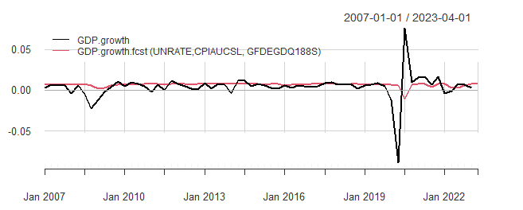
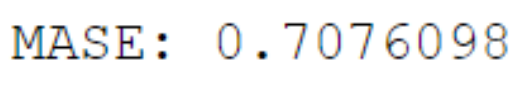

# GDP Growth Forecast with Keras (Tensorflow)

A one-step GDP Growth Forecast using all available quarterly GDP (GDPC1) data and user-selected predictors from the Federal Reserve Economic Data website. 
Used R's built-in REST API to prepare a machine-learning function (keras) that returns the single growth forecast value for the variable in the first column 
for the specified time period, using the remaining columns as predictors.

GDP Predictors Used:
- UNRATE: Unemployment Rate
- CPIAUCSL: Consumer Price Index for All Urban Consumers (All Items in U.S. City Average)
- GFDEGDQ188S: Federal Debt (Total Public Debt as Percent of Gross Domestic Product)

## Packages Used 
R 4.3.0
- keras
- fredr
- xts
- PerformanceAnalytics

## Backtest and Modeling

To ensure safe and accurate testing, I generated a backtest loop for all quarters 2007 Q1 up until the most recent 2023 data. 

The neural network uses an expanding time window for a specified duration that trains predictors and creates a forecast one
quarter into the future. Each loop adds additional information and repeats the training process. The goal is to encapsulate 
the process that happens every quarter. 
- Ex. Unemployment, C.P.I., and Federal Debt are lagged by one quarter each to predict the GDP for the following quarter. 

## Evaluation 

Forecast model evaluation reported using mean absolute scaled error (MASE). Actual vs. forecast quarterly GDP growth values
since 2007 Q1 visualized using PerformanceAnalytics time-series charts.

In this example, user-selected predictors showcased a 70.76% forecast accuracy and identical growth 
patterns during the duration.

## Notes
Personal API key omitted in code. 

Please retrieve a personal key from https://fred.stlouisfed.org/ to perform GDP forecasts with this model.
  
